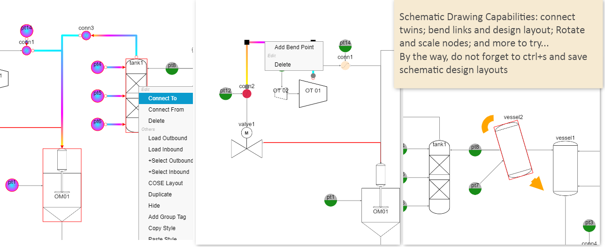

# Introduction
Azure IoT Rocks platform demonstrates an end to end digital twin solution, which is developed by using various Azure cloud services. It shows the implementation of many typical scerioes in IoT and Digital twin solutions, such as IoT devices telemetry and event data collection and visualization, digital twins modeling and binding with physical or virtual assets. IoT and Digital twin solutions are widely used in industry verticals such as smart building, manufacturing remote monitoring and control, energy system management and so on.

# Getting Started
There are various ways to start exploring journey:
-   Surf online live Azure IoT Rocks portal. It is the fastest way to start or even execute a POC project. Online system URL: https://azureiotrocksspa.z23.web.core.windows.net/
-   Deploy this repository to your own Azure subscription account. Refer to [deployment instruction](Documents/Deployment%20instruction.md)
-   Read [module and process flow document](Documents/AzureIoTRocks%20module%20and%20flow%20design.md) and [programming reference](Documents/Programming%20Reference.md). Fetch modules in interest to your own programming project.


## Basic Software Operations (for first time user)
-   After logging in, enter "Digital Twin" module.
-   The starting project is blank with no digital twin model definition and twins data yet. Click "start"
-   "Digital Twin Models" window pops up automatically. It is blank currently. Click "Create sample models" button to generate a few testing models. You may also start creating own digital twin models by click "Create/Modify Model". 
(Note: Digital twin models must have unique name. Please fill your own unique "name space" string to avoid model creation failure. A digital twin model's name looks like 
```diff
# dtmi:[name space]:[model ID]:[version numberic]
```
-   By default digital twins are shown as a gray color circle. You can customize appearance in "Digital Twin Models" window for different digital twin models.
-   Now there should be a few digital twin models in the left panel. Click the plus button of a digital twin model to create twins. Twins will be shown in the middle topology view.
-   Practise basic operatoins in topology vzew such as zooming, dragging, scaling/rotating twins etc. Undo and redo is available by pressing ctrl+z and ctrl+y.
-   Right click digital twins to access other operations such as connecting twins and highlighting twins' inbound or outbound peers. 
-   Modify digital twin's attributes by using information panel on the right side
-   Right click connecting line between twins to add bend point and adjust connection shape. Save current digital twins schematic layout by pressing "ctrl+s" and typing layout name. You can recall any saved layout from layout button in top side toolbar

## Explore More Software Features
-   Integrate schematic design into a digital twin world
The platform is capable of doing schematic diagram design. Not only you are able to create traditional CAD style schematic design in this digital twin platform, more importantly, your design is directly a digital twins network design now with all the support from cloud database service, IoT live data collection service, digital twin data processing service etc. Start migrating your static schematic designs to a live digital twin platform.


-   Digital Twins Data Processing<br/>
An important usage of digital twin solution is to decouple complicate business processing flow into smaller processing logic that attaches with each digital twins. For example, the purpose of the below system design is to use "majorController" unit to control three different switches so one of data source will be connected to the final twin entity. It is implemented by setting decoupled logic flow among different twins. This simplifies the design. It also provide better flexibility in expanding system. <br/>

Refer [calcualtion script guide](Documents/Twin_Calculation_Script_Guide.md) for samples and detail explaination.

-   IoT digital twin<br/>
Some of the digital twins represent physical world assets. They can be sensors, PLC machines, or even a data storage source such as ERP data source. In current platform, we will allow associate these physical assets with virtual digital twins through IoT hub service. If you define a digital twin model as IoT devices model, all its children digital twins will be provisioned to IoT services so the real world data can flow into platform and the live data will trigger other twins to execute calculation, like the previous section(Digital Twins Data Processing) shows.<br/>


# Development
-   [module and process flow document](Documents/AzureIoTRocks%20module%20and%20flow%20design.md) 
-   [programming reference](Documents/Programming%20Reference.md)

## Built With

* [JQuery](https://jquery.com/)
* [Cytoscape.js](https://js.cytoscape.org/#demos) (Note: customization code is added to fulfill project requirement)
* [Cytoscape Edge Editing extension](https://github.com/iVis-at-Bilkent/cytoscape.js-edge-editing) (Note: customization code is added to fulfill project requirement)
* [Azure Digital Twin Javascript SDK](https://docs.microsoft.com/en-us/javascript/api/@azure/digital-twins-core/?view=azure-node-latest)
* [Azure Identity Javascript SDK](https://docs.microsoft.com/en-us/javascript/api/@azure/identity/?view=azure-node-latest)
* [W3.CSS](https://www.w3schools.com/w3css/default.asp)
* [JQuery UI Layout](http://layout.jquery-dev.com/)


# Contributing
[TODO: Explain how to contribute]

# Authors
[Leo Lu](mailto:leolu@microsoft.com)


# License
MIT 
